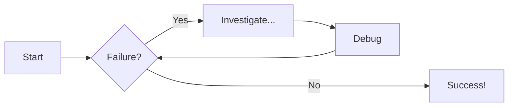
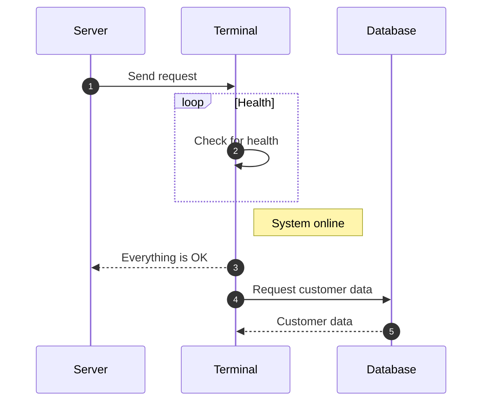
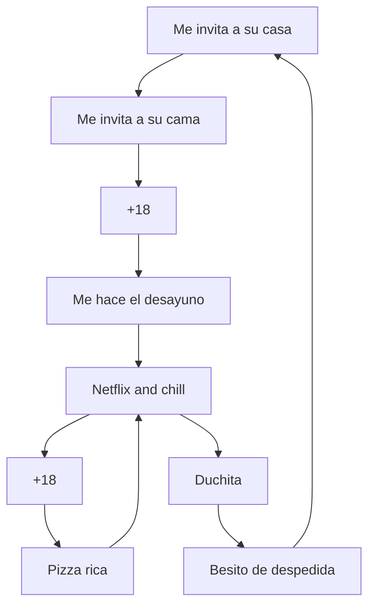

# Diagram Examples

## Flowcharts

```mermaid
graph LR
  A[Start] --> B{Failure?};
  B -->|Yes| C[Investigate...];
  C --> D[Debug];
  D --> B;
  B ---->|No| E[Success!];
```

## Sequence Diagrams

```mermaid
sequenceDiagram
  autonumber
  Server->>Terminal: Send request
  loop Health
      Terminal->>Terminal: Check for health
  end
  Note right of Terminal: System online
  Terminal-->>Server: Everything is OK
  Terminal->>Database: Request customer data
  Database-->>Terminal: Customer data
```

## Jess

```mermaid
graph TD
  A[Me invita a su casa] --> B[Me invita a su cama]
  B --> C[+18]
  C --> D[Me hace el desayuno]
  D --> E[Netflix and chill]
  E --> F[+18]
  F --> G[Pizza rica]
  G --> E
  E --> H[Duchita]
  H --> I[Besito de despedida]
  I --> A
```